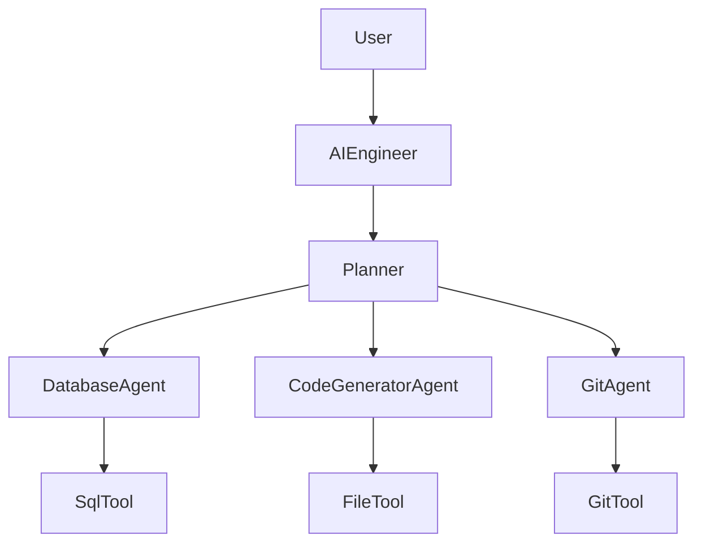

# Architecture Overview

## High Level

## Responsibilities

AIEngineer
- Accept user requests
- Orchestrates execution

Planner
- Creates execution plan

DatabaseAgent
- Reads database metadata

...
